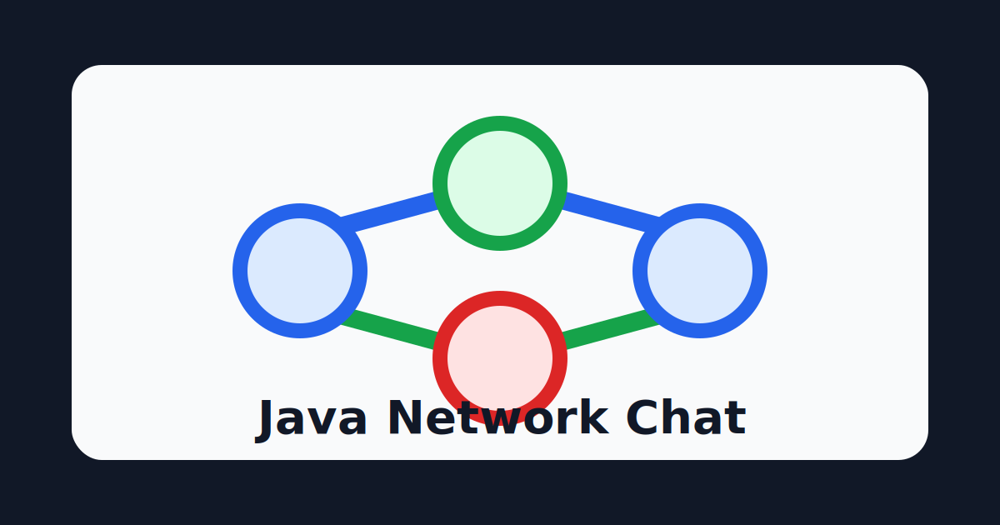
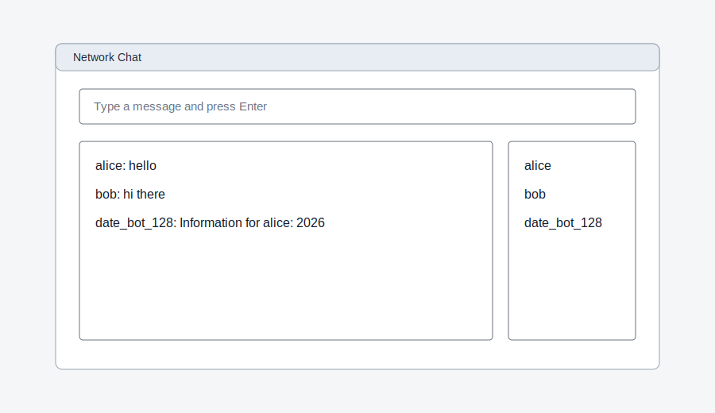

# Network Chat

[](https://github.com/krotname/JavaNetworkChat/actions/workflows/ci.yml)
[](https://github.com/krotname/JavaNetworkChat/actions/workflows/codeql.yml)
[](https://securityscorecards.dev/viewer/?uri=github.com/krotname/JavaNetworkChat)
[](https://github.com/krotname/JavaNetworkChat/actions/workflows/ci.yml)
[](https://adoptium.net/)
[](LICENSE)



Документация на английском языке: [README.en.md](README.en.md).

## Возможности

Network Chat — это Java 21 приложение для сетевого чата поверх TCP сокетов:

- сервер с handshake и рассылкой сообщений;
- консольный клиент;
- бот-клиент с командами времени/даты;
- GUI клиент на Swing с разделением на MVC;
- воспроизводимая Gradle-сборка, тесты, CI и проверки качества.



## Запуск

```bash
./gradlew runServer --args="--port 1500"
./gradlew runClient
./gradlew runBotClient
./gradlew runGuiClient
```

Сервер по умолчанию слушает порт `1500`. Для программного запуска используйте
`ChatServerConfig`: он задаёт порт, максимальное число клиентов, timeout handshake и timeout чтения
после handshake.

## Архитектура и протокол

Краткий архитектурный контракт описан в [docs/architecture.md](docs/architecture.md).

- `ChatServer` принимает TCP-соединения и обрабатывает клиентов в bounded executor.
- `ChatConnection` читает и пишет однострочные UTF-8 JSON frames.
- `ChatProtocol` сериализует `ChatMessage`.
- Для `TEXT` сообщений `data` содержит только исходный текст, а `sender` содержит автора.
- Console и Swing клиенты сами форматируют отображение вида `alice: hello`.
- Bot client отвечает на команды времени/даты по `data`, используя автора из `sender`.

## Тесты и качество

- `./gradlew test`
- `./gradlew integrationTest`
- `./gradlew uiTest`
- `./gradlew check`
- `./gradlew jacocoAllReport`
- `./gradlew jacocoTestCoverageVerification`

В CI HTML-отчёт JaCoCo публикуется как artifact, а line/branch coverage добавляется в GitHub
Actions Summary для Linux job.

## Стратегия тестирования

- **Unit-тесты** (`src/test/java`) — протокол, bot-команды, модель GUI.
- **Интеграционные тесты** (`src/integrationTest/java`) — подключение клиентов, handshake, лимиты сервера, timeout и обмен сообщениями.
- **UI smoke тесты** (`src/uiTest/java`) — проверка отрисовки состояния окна чата.
- **План развития** — больше негативных сценариев протокола и проверок отказоустойчивости медленных клиентов.

Для оценки покрытия используется JaCoCo: в CI порог для ядра (`network` + `protocol`) — `80%/65%` (`line`/`branch`).

## Troubleshooting

- `Address already in use`: запустите сервер на другом порту, например `./gradlew runServer --args="--port 1600"`.
- GUI не показывает окно в CI: UI smoke тесты автоматически пропускаются в headless окружении.
- Клиент сразу отключился: проверьте уникальность имени и длину ника (`3..64`, буквы, цифры, `_`, `-`).
- Клиент получил `Server is busy`: достигнут `maxClients` из `ChatServerConfig`.

## Структура репозитория

- `src/main/java` — код приложения.
- `src/test/java` — unit-тесты.
- `src/integrationTest/java` — интеграционные тесты.
- `src/uiTest/java` — smoke тесты UI.
- `docs` — архитектурные заметки и визуальные материалы.
- `.github/workflows` — CI и проверки безопасности.

## Дополнительные сигналы качества

- CI на Linux и Windows.
- Авто-проверки: Checkstyle, Spotless, SpotBugs, JaCoCo.
- Security проверки: CodeQL и OpenSSF Scorecard.
- Dependabot с группировкой обновлений зависимостей и Actions.
- Явно оформленные файлы `CONTRIBUTING.md` и `SECURITY.md`.

## Roadmap

- v1.1.x: стабилизация protocol/server lifecycle, расширение негативных тестов, улучшение документации.
- Позже: комнаты, история сообщений, TLS и персистентные аккаунты отдельными функциональными этапами.
